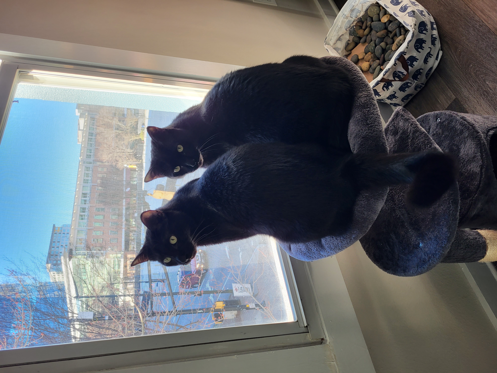

I've needed my ass kicked for a while now. I set out to launch this first post 10 months ago. And no, I haven't been too busy...I've been doing all the things I shouldn't. Letting perfect be the enemy of good, paralysis by analysis, and all those very cheesy, but very apt sayings that boil down to one thing: **getting in my own way**. 

For someone in tech, I'm a bit of a luddite. I mean, I'm _starting_ a blog in ~~2021~~ 2022...I grew up when LiveJournal was _just_ becoming big and yet here I am now, writing my _first_ blog. But I've decided to finally bite the bullet and begin writing things down because I realized I actually _do_ have a point-of-view that may (or may not) be worth sharing. Historically, I've had many opinions (some _terrible_) but now that I'm climbing up that figurative hill of life (or running, as Summer 2022 will have us remember), I feel I _finally_ have **direction**.

So what should you expect from this weekly (oh god, that's not going to happen), monthly, maybe bi-annual blog series. It's going to be all about content&mdash;sort of. It's going to be about _creating_ content, but not the content itself. What does this mean? I **won't** talk about the ideal number of words for your blog post or SEO (that's not my bag, baby), but I **will** talk about how you can leverage technical tools to your advantage, how you can "appropriate" (_technology appropriation, not cultural appropriation_) from other fields to make your content better, and I will talk (a hell of a lot, probably) about content operations and process improvements because I'm damn good at them.

In case that didn't entice you, you'll also get some great (and totally unrelated) cat content, like the two rascals below.

  

