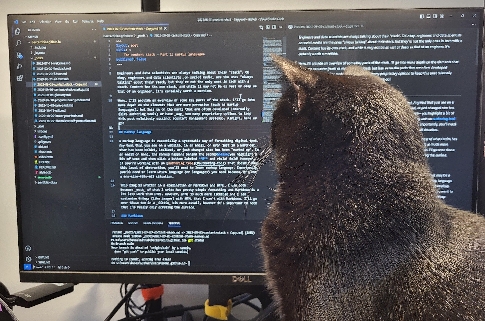

In the first post of the this series, I wrote about markup languages. To show how those markup languages shape your text, you need an _authoring tool_, otherwise your text will \_just\_ look \*\*crazy\*\* and you won't know what you've actually done to it. Here we'll dive into some of the key features of an authoring tool and look at some widely used tools.

## Authoring tools

If you're thinking, isn't this just a text editor? Well yea, _sometimes_ it is. 

If you use a proprietary [content management system](../coming-soon), chances are you're using their built-in authoring tool. 

## Summary

Next up in the content stack series is [metadata](../coming-soon)&mdash;data about data.

Need to catch up? Check out [part 1: markup languages](../content-stack-markup)

[]: 
[]: 
[]: 
[]: 
[]: 
[]: 
[]: 
[]: 
[]: 
[]: 
[]: 
[]: 
[]: 
[]: 
[]: 
[]: 
[]: 